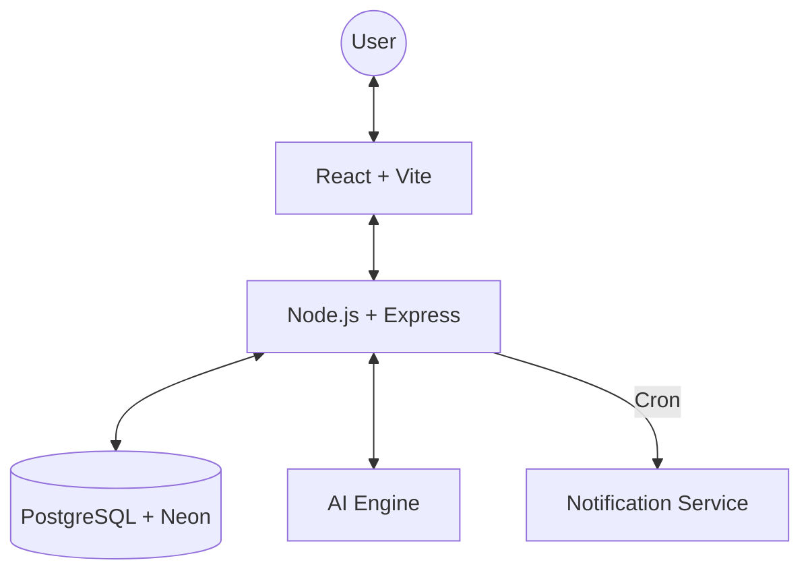

# TheatreX Operating Theatre Management System

**Version:** 1.1.0 | **Status:** 🚀 Production Live | **Last Updated:** March 29, 2026

> A comprehensive operating theatre management system for hospitals to efficiently manage surgeries, theatre operations, staff scheduling, and real-time notifications.

[](https://github.com/PasinduJayasinghe2004/SDGP-Project/actions/workflows/frontend-ci.yml)
[](https://github.com/PasinduJayasinghe2004/SDGP-Project/actions/workflows/backend-ci.yml)

## 📋 Table of Contents

1. [Project Overview](#-project-overview)
2. [Key Features](#-key-features)
3. [Architecture](#-architecture)
4. [Technology Stack](#-technology-stack)
5. [Real-Time Notification System](#-real-time-notification-system)
6. [Getting Started](#-getting-started)
7. [Project Structure](#-project-structure)
8. [API Endpoints](#-api-endpoints)
9. [Deployment](#-deployment)
10. [Support](#-support)

---

## 📋 Project Overview

**TheatreX** is an enterprise-grade Operating Theatre Management System designed to streamline hospital workflows:

- ✅ **Smart Scheduling** - Conflict-aware surgery booking with theatre and staff allocation.
- ✅ **Dynamic Notifications** - Real-time alerts and multi-stage reminders for medical staff.
- ✅ **Emergency Management** - Fast-track booking system for urgent surgical cases.
- ✅ **Resource Optimization** - Real-time theatre availability and status tracking.
- ✅ **Analytics & AI** - Data-driven insights and AI-powered chatbot assistant (Gemini).

---

## ⭐ Key Features

### 🏥 Surgery Management
- Automated conflict detection for theatres, surgeons, and staff.
- Support for regular and **emergency** bookings.
- Real-time status transitions (Scheduled → In Progress → Completed).

### 🔔 Real-Time Notification System (New!)
- **Instant Toasts**: Immediate UI feedback via `react-toastify` for new assignments.
- **Delta Polling**: Efficient backend polling to fetch new alerts every 30 seconds.
- **Automated Reminders**: Built-in scheduler sends reminders **1 hour** and **15 minutes** before surgery.
- **Role-Based Routing**: Notifications are accurately linked to user accounts via email-staff mapping.

### 🎭 Theatre Operations
- Monitor theatre status (Available, In Use, Cleaning, Maintenance).
- Maintenance and cleaning record tracking.
- Equipment health monitoring and alerts.

### 📊 Analytics & Reporting
- Visual dashboards for surgery trends and theatre utilization.
- PDF/CSV export for surgery histories and performance reports.
- AI Chatbot for quick data queries and system help.

---

## 🏗️ Architecture



---

## 📦 Technology Stack

### Frontend
- **Framework**: React 19 (Vite)
- **Styling**: Tailwind CSS, Lucide Icons
- **State Management**: React Context API
- **Feedback**: React-Toastify
- **Charts**: Google Charts, FullCalendar

### Backend
- **Framework**: Node.js (Express)
- **Database**: PostgreSQL (Neon Serverless)
- **Task Runner**: node-cron (Surgery Reminders)
- **Security**: JWT, bcryptjs, Helmet, Rate Limiting
- **API Support**: Gemini Flash (AI Chatbot)

---

## 🚀 Getting Started

### Prerequisites
- Node.js 18.0+
- PostgreSQL (or Neon DB account)
- GEMINI_API_KEY (for AI features)

### Quick Start

**1. Clone and Install**
```bash
git clone https://github.com/PasinduJayasinghe2004/SDGP-Project.git
cd SDGP-Project
```

**2. Backend Setup**
```bash
cd backend
npm install
# Configure .env (DATABASE_URL, JWT_SECRET, GEMINI_API_KEY)
npm run dev
```

**3. Frontend Setup**
```bash
cd ../frontend
npm install
npm run dev
```

**4. Access**
- **Dashboard**: `http://localhost:5173`
- **API Health**: `http://localhost:5000/api/health`

---

## 🏗️ Project Structure

```
SDGP-Project/
├── frontend/             # React Application
│   ├── src/
│   │   ├── components/   # UI Components (Header, Notifications, etc.)
│   │   ├── pages/        # Dashboard, Surgery, Staff pages
│   │   ├── services/     # API Service layers
│   │   └── context/      # Auth and UI Global state
├── backend/              # Express API
│   ├── controllers/      # Business Logic
│   ├── models/           # DB Schemas & Class Models
│   ├── routes/           # API Endpoints
│   ├── utils/            # Schedulers & Helpers
│   └── config/           # DB & Cloud config
```

---

## 🔌 API Endpoints Summary

| Method | Endpoint | Description |
| :--- | :--- | :--- |
| `POST` | `/api/auth/login` | Secure JWT Authentication |
| `POST` | `/api/surgeries` | Schedule new surgery (with alerts) |
| `GET` | `/api/notifications/poll` | Fetch new delta-notifications |
| `GET` | `/api/theatres` | Real-time theatre status tracking |
| `POST` | `/api/chatbot` | Interact with Gemini AI assistant |

---

## 📤 Deployment

- **Frontend**: Deployed on **Vercel**
- **Backend API**: Deployed on **Railway / Render**
- **Database**: **Neon PostgreSQL**

For production settings and environment variables, refer to `Md files/PRODUCTION_CONFIG.md`.

---

## 🤝 Team
**Module Leads:**
- M1: Authentication & Setup
- M2: Surgery Management  
- M3: Theatre Management
- M4: Staff Management
- M5: Patient & Notifications
- M6: Integration & Documentation

---

## 💬 Support
For support, create an issue in the [GitHub Repository](https://github.com/PasinduJayasinghe2004/SDGP-Project) or contact the development team.

---
**Last Updated:** March 29, 2026 | TheatreX Team
